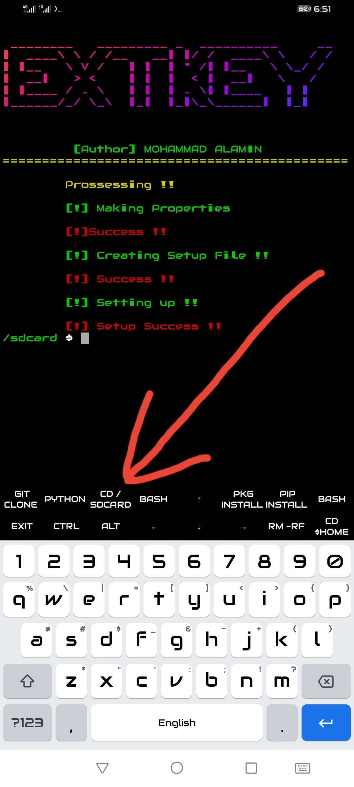

<h1 align="center">
☆ᴍᴏʜᴀᴍᴍᴀᴅ ᴀʟᴀᴍɪɴ☆
</h1>


<p align="center">
<a href="https://m.me/AK27X"></a></p><br>
<p align="center">
<a href="https://fb.com/AK27X"></a></p><br>
<p align="center">
<a href="https://github.com/AK27X"></a> 
</p><br>

<h2 align="center">☆[INFORMATION]☆</h2>

* Termux extra key😴<br> Thanks.<br></p>


<h3 align="center">☆[INSTALL]☆</h3>

```
apt update && upgrade -y
pkg install git -y
git clone https://github.com/AK27X/t-key
pkg install python -y
pkg install ruby -y
pkg install figlet
pip install requests
pip install coloroma
gem install lolcat
```

<h5 align="center">☆[RUN]☆<h5>

```
cd t-key

python key
```
<p align="center">
  
</p>
<h4 align="center">☆[UNINSTALL]☆<h4>

```
rm -rf t-key
```

<h6 align="center">
☆CONTACT☆
</h5>
<p align="center"><a href="https://AK27X.github.io"></a>
